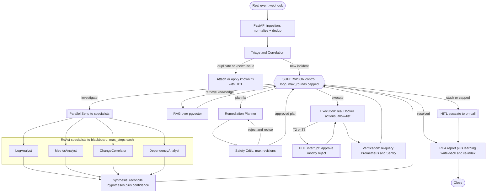

# Enterprise Multi-Agent Incident & Knowledge Resolution System — Final Blueprint (v3)

This is the single source of truth we build from. It merges v1's "reuse what you already know" discipline with v2's genuinely agentic architecture, and locks in your decisions: real Sentry + Prometheus + GitHub + Docker, Postgres/pgvector (no Redis), 3-4 specialists, `max_rounds` on every loop, and demo-safe Docker actions. Grounding for the demo/test design comes from `Solutions_from_AI.md`.

Deliverable of THIS step: write this document to `incident_system_blueprint.md`. No code is written until we start the phased build.

## 0. Locked decisions
- Architecture: supervisor-orchestrated dynamic control loop (v2), not a fixed 1-to-7 pipeline.
- Real integrations: Sentry, Prometheus, GitHub, Docker — all real, all read via bounded `@tool`s (Docker also acts).
- Store: single Postgres instance with pgvector. It is the checkpointer, the relational store (incidents/actions/approvals/audit), the long-term memory, AND the vector store. No Redis; intake is direct webhook-to-worker.
- Specialists: 4 parallel ReAct subgraphs — LogAnalyst, MetricsAnalyst, ChangeCorrelator, DependencyAnalyst — writing to a shared blackboard.
- Token safety: hard `max_rounds` / `max_steps` caps on the supervisor loop, each specialist's ReAct loop, the planner-critic debate, and the verification retry loop.
- Docker safety: strict container allow-list, arg validation against a demo inventory, no generic shell/exec tool, dry-run default, HITL + RBAC on destructive tiers.
- Demo target: two instrumented FastAPI services (orders-api -> payments-api -> Postgres), scenario-driven fault injection, pre-built knowledge corpus.
- Assumptions to confirm during build: LLM provider is OpenAI (your projects use `ChatOpenAI`); Sentry is the cloud free tier (webhooks); everything runs locally via docker-compose on Docker Desktop.

## 1. How this maps to what you already know
- Supervisor loop: your Blog Writer router/orchestrator + Iterative `route_evaluation`, elevated into a return-to loop.
- Specialists (ReAct): your Chatbot `ToolNode` + `tools_condition` loop, wrapped as subgraphs with a step cap.
- Parallel blackboard: your Parallel Workflow `Send` fan-out + `operator.add` reducer (`sections`/`individual_scores`).
- Synthesis reconcile: your Parallel Workflow `final_evaluation` fan-in.
- Retrieval: your Chatbot RAG (`PyPDFLoader` -> splitter -> retriever), store swapped FAISS -> pgvector behind the same `as_retriever` interface.
- Planner + Critic debate: your Iterative Workflow (generator <-> evaluator <-> optimizer) with a max-iteration cap.
- Execution + HITL: your HITL stock-purchase `interrupt()` / `Command(resume=)`.
- Persistence + resume-after-approval: your Persistence project checkpointer, keyed by `incident_id` as `thread_id`.
- Long-term learning: your Long-term Memory `BaseStore` + `is_new` dedup, now Postgres-backed.
- UI: your two Streamlit apps (threads, streaming, tabs, downloads).

## 2. Architecture



The supervisor decides each loop among: investigate, retrieve, plan, execute, escalate, close — based on current hypotheses, confidence, severity, and rounds spent. Two incidents take different paths.

## 3. Loop caps (config.py — token budget guardrails)
Every loop is bounded. All caps live in one config module so they are easy to tune.
- `SUPERVISOR_MAX_ROUNDS` (e.g. 6): total supervisor decisions before forced escalate/close.
- `INVESTIGATION_MAX_ROUNDS` (e.g. 3): confidence-driven re-investigation cycles.
- `SPECIALIST_MAX_STEPS` (e.g. 4): ReAct tool-call steps per specialist before it must emit its best hypothesis.
- `CRITIC_MAX_REVISIONS` (e.g. 3): planner <-> critic debate rounds before the current plan is forced to HITL.
- `VERIFICATION_MAX_RETRIES` (e.g. 2): failed-remediation retries before escalate.
- Confidence thresholds: proceed at >= 0.80; investigate more between 0.50 and 0.80; force another investigation round below 0.50.
- Model tiering to save tokens: cheap/fast model for Supervisor/Triage routing; stronger model for Synthesis/Planner/Critic (you already tier `generator/evaluator/optimizer` LLMs).

## 4. Docker action safety (demo-hardened)
The single riskiest part, so it is fenced in `tools/docker_tools.py`:
- Allow-list only: every action validates the target container against `DEMO_CONTAINER_ALLOWLIST` (by name prefix and a required label like `incident-demo=true`). Anything not on the list is denied and audited.
- No generic tool: only `restart_service`, `rollback_deploy(sha_or_tag)`, `scale_service`, `clear_cache`, `run_healthcheck`, `toggle_feature_flag`. Never an exec/shell/arbitrary-API tool.
- `rollback_deploy` only swaps image tags defined in the demo compose; it cannot pull or run arbitrary images.
- Dry-run default: a `DRY_RUN` flag simulates the action and logs intent; real execution requires it off plus passing the risk gate.
- Risk tiers: T0 read-only auto; T1 reversible auto for low severity / interrupt for high; T2 production-impacting always interrupt; T3 destructive mandatory interrupt + RBAC approver recorded in the audit entry.
- Least privilege: destructive tools use a separately-scoped Docker credential/socket access, gated behind HITL.

## 5. State design (blackboard + control)
Single shared `IncidentState` (your Blog Writer model). Multi-writer channels use `operator.add` reducers.
```python
class IncidentState(TypedDict):
    incident_id: str
    event: IncidentEvent                       # normalized real event
    # triage
    is_duplicate: bool
    matched_known_issue: Optional[KnownIssue]
    # investigation blackboard (parallel specialists append)
    hypotheses: Annotated[list[Hypothesis], operator.add]
    root_cause: Optional[RootCause]            # from Synthesis
    investigation_rounds: int
    # knowledge + plan
    retrieved: list[RetrievedDoc]
    plan: Optional[RemediationPlan]
    critic_rounds: int
    # execution (append-only audit)
    executed_actions: Annotated[list[ActionResult], operator.add]
    audit_log: Annotated[list[AuditEntry], operator.add]
    # control
    next_action: Literal["investigate","retrieve","plan","execute","escalate","close"]
    confidence: float
    supervisor_rounds: int
    status: Literal["triage","investigating","planning","awaiting_approval","resolved","escalated"]
    # output
    verification: Optional[VerificationResult]
    rca_report_md: str
```
Pydantic contracts to define: `IncidentEvent`, `KnownIssue`, `Hypothesis {statement, evidence[], confidence, source_agent}`, `RootCause`, `RetrievedDoc {source, doc_type, service, score}`, `RemediationPlan` + `RemediationStep {action_type, risk_tier, preconditions, expected_outcome, rollback, source_citation}`, `ActionResult`, `AuditEntry`, `VerificationResult`.

## 6. Postgres + pgvector schema (unified store)
One database, several roles (replaces SQLite checkpoints + FAISS + ad-hoc dicts):
- `incidents`, `actions`, `approvals`, `audit_logs`, `services`, `deployments`, `knowledge_documents`.
- `embeddings` (pgvector column) for both knowledge chunks and historical RCA records, enabling semantic similarity search for RAG and for Triage known-issue matching.
- LangGraph checkpointer uses the Postgres checkpointer (resume-after-approval survives restarts).
- Long-term memory (`memory/longterm.py`) stores distilled learnings with `is_new` dedup in Postgres.

## 7. RAG + learning loop
- Pre-built corpus in `knowledge/`: `sops/`, `runbooks/`, `historical_rca/` (start with 6-8 historical incidents, each with description, symptoms, logs, metrics, root cause, remediation, verification, severity, service).
- `rag/build_index.py` ingests offline into pgvector; retriever filters by `service` and `doc_type`; query built from root cause + affected service, not raw logs.
- Grounding contract: remediation may only cite retrieved sources; unsourced steps are flagged "human review required".
- Learning write-back: on resolution, generate the RCA markdown, write a distilled learning to memory, and re-index the RCA into pgvector so Triage recognizes the class next time. RAG provides evidence, it does not dictate the fix (the "similar but different" test enforces this).

## 8. Demo target + scenario-driven fault lab
- `demo_target/`: `orders_api` and `payments_api` (FastAPI), instrumented with `sentry_sdk` and `prometheus_client`; depend on Postgres.
- `demo_target/faults/`: toggleable fault injectors (exception, 500 storm, latency, DB timeout, connection leak, memory leak, bad-deploy image, config error, dependency outage).
- `chaos/controller.py` + `chaos/scenarios/*.json`: reproducible scenarios so a run can be replayed after code changes.
- Deliberately design multi-signal, ambiguous, and false-lead incidents (from `Solutions_from_AI.md`) so confidence loops and multi-agent reconciliation have real work.

## 9. Repository layout (all files we will create)
- `README.md`, `requirements.txt`, `.env.example`, `docker-compose.yml` (postgres+pgvector, prometheus, demo services).
- `demo_target/orders_api/{main.py,Dockerfile}`, `demo_target/payments_api/{main.py,Dockerfile}`, `demo_target/common/instrumentation.py`, `demo_target/faults/injectors.py`.
- `chaos/controller.py`, `chaos/scenarios/scenario_*.json`.
- `ingestion/app.py` (FastAPI `/webhook`, `/approve`), `ingestion/normalize.py`, `ingestion/dedup.py`.
- `agent/state.py`, `agent/config.py`, `agent/graph.py`, `agent/supervisor.py`, `agent/triage.py`.
- `agent/specialists/{base.py,log_analyst.py,metrics_analyst.py,change_correlator.py,dependency_analyst.py}`.
- `agent/synthesis.py`, `agent/retrieval.py`, `agent/planner.py`, `agent/critic.py`, `agent/execution.py`, `agent/verification.py`, `agent/reporting.py`.
- `tools/{sentry_tools.py,prometheus_tools.py,github_tools.py,docker_tools.py,redaction.py}`.
- `knowledge/{sops,runbooks,historical_rca}/*.md`, `rag/{build_index.py,store.py}`.
- `db/schema.sql`, `memory/longterm.py`, `observability/langsmith.py`.
- `ui/streamlit_app.py`.
- `tests/scenarios/` mapping the 16 behavioral tests.

## 10. Test catalogue (from Solutions_from_AI.md)
Sixteen behavioral tests across 7 levels: basic incidents (exception, 500 spike, latency); diagnostic differentiation (DB pool exhaustion, bad deploy, dependency failure); multi-agent reasoning (conflicting evidence, false lead); supervisor loop (low confidence -> re-investigate, verification failure -> re-investigate); RAG (known incident, similar-but-different); safety/HITL (low-risk auto, high-risk approval, rejected action); escalation (nothing works -> escalate). Each maps to a scenario JSON for reproducibility.

## 11. Security carry-overs
- Move all secrets to env/secret manager. Concrete fix: the hardcoded Alpha Vantage key in your chatbot/HITL code (`apikey=C9PE94QUEW9VWGFM`) must not be repeated here; rotate it.
- Treat logs, stack traces, and runbooks as untrusted input (prompt-injection defense): agents emit typed plans, only allow-listed tools act.
- Immutable audit trail in Postgres; PII/secret redaction before any text reaches the LLM (`tools/redaction.py`).

## 12. Build order (each phase leaves a runnable system)
See todos. Phases 0-2 stand up infra + demo + knowledge; 3-4 get a real event flowing through a stubbed supervisor; 5-8 add the agentic core, RAG, real execution, verification/learning; 9-10 add the console and the full test lab + observability polish.