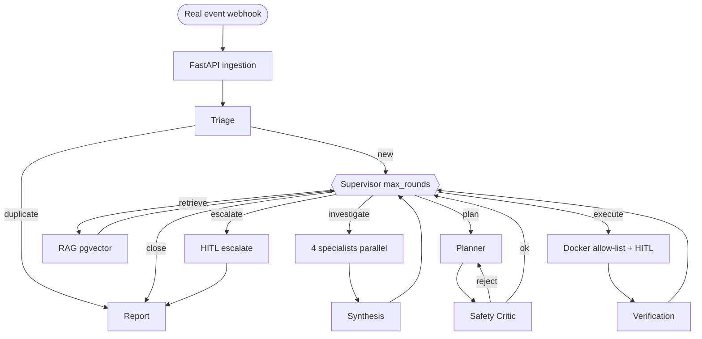

# Enterprise Multi-Agent Incident & Knowledge Resolution System — Final Blueprint (v3)

This is the single source of truth we build from. It merges v1's "reuse what you already know" discipline with v2's genuinely agentic architecture, and locks in your decisions: real Sentry + Prometheus + GitHub + Docker, Postgres/pgvector (no Redis), 3–4 specialists, `max_rounds` on every loop, and demo-safe Docker actions. Grounding for the demo/test design comes from `Solutions_from_AI.md`.

**Implementation status:** Phases 0–10 are scaffolded in this repository. Follow the Quick start in `README.md`.

## 0. Locked decisions
- Architecture: supervisor-orchestrated dynamic control loop (not a fixed 1→7 pipeline).
- Real integrations: Sentry, Prometheus, GitHub, Docker — bounded `@tool`s (Docker also acts).
- Store: single Postgres + pgvector for checkpointer, relational data, long-term memory, and vectors. No Redis.
- Specialists: 4 parallel ReAct subgraphs — LogAnalyst, MetricsAnalyst, ChangeCorrelator, DependencyAnalyst.
- Token safety: hard caps on supervisor, specialists, planner↔critic, and verification retries.
- Docker safety: allow-list, label gate, no generic shell, `DRY_RUN` default, HITL + RBAC on T2/T3.
- Demo target: orders-api → payments-api → Postgres, scenario-driven fault injection, pre-built knowledge corpus.

## 1. Map to prior projects
| Concern | Pattern you already know |
|---|---|
| Supervisor loop | Blog Writer router + Iterative `route_evaluation` |
| Specialists | Chatbot ToolNode loop as capped subgraphs |
| Blackboard | Parallel Workflow `Send` / `operator.add` |
| Synthesis | Parallel Workflow final evaluation |
| Retrieval | Chatbot RAG → pgvector behind same idea |
| Planner ↔ Critic | Iterative generator/evaluator with max iterations |
| Execution HITL | `interrupt()` / `Command(resume=)` |
| Persistence | Checkpointer keyed by `incident_id` |
| Learning | Long-term memory `is_new` dedup → Postgres |
| UI | Streamlit console |

## 2. Architecture



## 3. Loop caps (`agent/config.py`)
- `SUPERVISOR_MAX_ROUNDS=6`
- `INVESTIGATION_MAX_ROUNDS=3`
- `SPECIALIST_MAX_STEPS=4`
- `CRITIC_MAX_REVISIONS=3`
- `VERIFICATION_MAX_RETRIES=2`
- Proceed ≥ 0.80 · investigate more 0.50–0.80 · force re-investigate < 0.50
- Fast model for Supervisor/Triage; strong model for Synthesis/Planner/Critic

## 4. Docker action safety (`tools/docker_tools.py`)
- `DEMO_CONTAINER_ALLOWLIST` + label `incident-demo=true`
- Tools: restart_service, rollback_deploy, scale_service, clear_cache, run_healthcheck, toggle_feature_flag
- Rollback only to allow-listed tags
- `DRY_RUN=true` by default
- T0 auto · T1 reversible · T2/T3 HITL (+ RBAC on T3)

## 5. State (`agent/state.py`)
`IncidentState` with blackboard `hypotheses` (reducer), append-only `executed_actions` / `audit_log`, control channel `next_action`, confidence, round counters.

## 6. Postgres + pgvector (`db/schema.sql`)
Tables: services, deployments, incidents, actions, approvals, audit_logs, knowledge_documents, embeddings (vector 1536), learnings.

## 7. RAG + learning
- Corpus under `knowledge/{sops,runbooks,historical_rca}/`
- `python -m rag.build_index`
- Grounding: remediation steps must cite retrieved sources
- On resolve: RCA markdown + learning write-back + re-index

## 8. Demo + chaos
- `demo_target/orders_api`, `demo_target/payments_api` with Sentry/Prometheus + `/fault`
- `python -m chaos.controller --scenario scenario_02_bad_deploy`

## 9. Key paths
- `ingestion/app.py` — `/webhook/{source}`, `/incidents`, `/approve`
- `agent/graph.py` — compiled graph
- `ui/streamlit_app.py` — console
- `tests/scenarios/catalogue.yaml` — T01–T16
- `tests/run_smoke.py` — offline checks

## 10. Security
- Secrets only via `.env` (see `.env.example`)
- Redaction in `tools/redaction.py`
- Treat logs/runbooks as untrusted data; only allow-listed tools act
- Immutable audit trail

## 11. Quick start
```bash
cp .env.example .env
docker compose up -d
python -m venv .venv && source .venv/bin/activate
pip install -r requirements.txt
# wait for postgres, then:
psql "$DATABASE_URL" -f db/schema.sql   # or rely on compose init
python -m rag.build_index
uvicorn ingestion.app:app --reload --port 8080
streamlit run ui/streamlit_app.py
python -m chaos.controller --scenario scenario_02_bad_deploy
python -m tests.run_smoke
```
